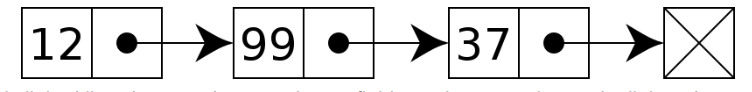
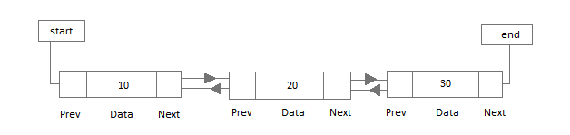

# Linked list

## What is a Linked list? 
Linked lists are described as linear data structures. They are made up of a series of nodes, where each element is its own separate object. Each node contains 2 parts:
- Its own data 
- A reference to the next item in the list.

```javascript
class Nodo {
	constructor(data) {
		this.value = data;
		this.next = null;
		this.before = null;
	}
}
````

## Types of linked lists.
While this article will focus on “singly” linked lists, it’s also worth mentioning that there are a few other types of linked lists, with each type having slightly different functionality.


### Singly linked list
Only has a next pointer and can only be traversed in sequence from the head to the end.



A singly linked list whose nodes contain two fields: an integer value and a link to the next node

### Doubly linked list
Contains a reference to the next node and as well the previous node in the sequence.

