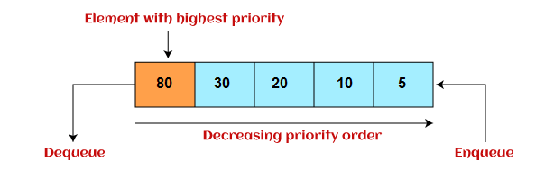

# Queue

A Queue is a linear structure which follows a particular order in which the operations are performed. The order is First In First Out (FIFO). A good example of a queue is any queue of consumers for a resource where the consumer that came first is served first.

## types

- Simple Queue or Linear Queue
- Priority Queue

## Simple Queue or Linear Queue

In Linear Queue, an insertion takes place from one end while the deletion occurs from another end. The end at which the insertion takes place is known as the rear end, and the end at which the deletion takes place is known as front end. It strictly follows the FIFO rule.

## Priority Queue

It is a special type of queue in which the elements are arranged based on the priority. It is a special type of queue data structure in which every element has a priority associated with it. Suppose some elements occur with the same priority, they will be arranged according to the FIFO principle. The representation of priority queue is shown in the below image -

Types of Queue
Insertion in priority queue takes place based on the arrival, while deletion in the priority queue occurs based on the priority. Priority queue is mainly used to implement the CPU scheduling algorithms.
